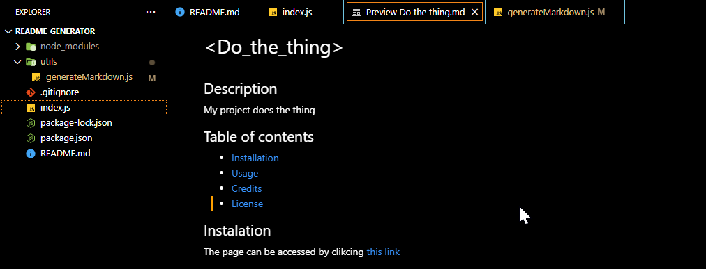

# README Generator

A web-based README generator with a retro terminal aesthetic. Fill out a form on the left, get a live-rendered preview on the right, and download a polished `.md` file with one click.



## Table of Contents

- [Features](#features)
- [Tech Stack](#tech-stack)
- [Installation](#installation)
- [Usage](#usage)
- [Deployment](#deployment)
- [Credits](#credits)
- [License](#license)

## Features

- **Live preview** — the rendered README updates as you type, displayed on a paper-like pane next to the form
- **Retro terminal UI** — JetBrains Mono font, phosphor green accent, CRT scanline overlay, ASCII logo header
- **Drag-to-reorder sections** — grab the `⠿` handle on any section to change its order in the output
- **Section toggles** — include or exclude any section from the final output with `[●] on / [ ] off`
- **Rich section support** — Title, Badges, Description, Table of Contents, Installation, Usage, Features, Contributing, Tests, Credits, License, Author, and custom sections
- **Tech stack badges** — comma-separated stack input auto-generates shield.io badges
- **Expanded license options** — MIT, ISC, Apache 2.0, GPLv3, BSD 3-Clause, Unlicense
- **Inline validation** — URL, email, and GitHub handle fields validate as you type
- **Char counts** — fields with limits show a live counter that warns as you approach the cap
- **"Use example" autofill** — each field has a sample value you can drop in with one click
- **Confetti + sound on download** — ASCII confetti burst and a chord chime reward you for finishing
- **Typewriter sounds** — subtle click on each keystroke (toggleable)
- **localStorage persistence** — your form data survives page reloads
- **Tweaks panel** — change the accent color (5 presets + custom picker), toggle CRT scanlines, toggle sounds
- **Render / raw toggle** — switch the preview between rendered HTML and raw markdown
- **Download or copy** — download the `.md` file directly or copy the markdown to clipboard

## Tech Stack

| Layer | Technology |
|---|---|
| Frontend | React 18, Vite |
| Styling | JetBrains Mono, custom CSS variables |
| Markdown rendering | react-markdown, remark-gfm |
| Backend | Express.js |
| Deployment | Vercel (serverless API + static frontend) |

## Installation

Clone the repo and install dependencies for both the root and the client:

```bash
git clone https://github.com/jmarq019/readme_generator.git
cd readme_generator
npm install
npm install --prefix client
```

## Usage

Start both the Express server and the Vite dev server concurrently:

```bash
npm run dev
```

Then open [http://localhost:5173](http://localhost:5173) in your browser.

- The Express API runs on port 3001
- The Vite dev server proxies `/api` requests to it automatically

To run only the Express server:

```bash
npm run server
```

To run only the frontend:

```bash
npm run client
```

## Deployment

The app is configured for [Vercel](https://vercel.com). The `vercel.json` at the root tells Vercel to:

1. Install dependencies for both root and `client/`
2. Build the Vite frontend
3. Serve `client/dist` as the static site
4. Route `/api/generate` to the serverless function in `api/generate.js`

To deploy, push to GitHub and import the repo on vercel.com — no additional configuration needed.

## Credits

Built as a homework project for the UW Full Stack Coding Bootcamp. Starter code and guidance provided by the bootcamp instructors and TAs. Frontend redesign inspired by the retro terminal aesthetic.

## License

ISC License

[](https://choosealicense.com/licenses/isc/)
